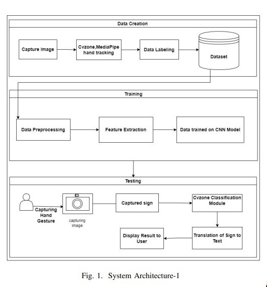

# ISL Interpreter System
The **Indian Sign Language (ISL) Interpreter System** bridges the communication gap between the hearing-impaired and non-signing individuals. Utilizing curated datasets and advanced models like CNN and cvzone-based object detection, the system translates short sign words into text in real-time. This tool addresses challenges in emergency communication and promotes inclusivity and accessibility.

## 🎯 Objectives
- **Curated Dataset Creation**: Develop a dataset of **Indian Sign Language (ISL)** gestures, forming the foundation for accurate gesture recognition.
- **Real-Time Translation**: Build a system capable of translating **short sign words into text** in real-time, enabling smooth communication.
- **Bridging Communication Gap**: Facilitate seamless interaction between **deaf** individuals and **non-signing** individuals, fostering inclusivity in everyday conversations.

## 🚀 Features

### 1. **Hand Gesture Recognition**
- Leverages **advanced neural networks** to detect and interpret hand gestures in **real-time**.
- Converts hand movements and positions into **text**, enabling seamless communication for the hearing-impaired community.

### 2. **Curated Dataset**
- A specialized dataset of **Indian Sign Language (ISL)** gestures is used to train the system.
- The dataset ensures **high-quality data representation**, improving recognition accuracy and system reliability.

### 3. **Advanced Neural Models**
- **Convolutional Neural Networks (CNN):** Extract spatial features from gesture images to recognize patterns and structures necessary for classification.
- **cvzone Hand Tracking Module:** Detects and tracks hands in **real-time**, enhancing live use performance.

### 4. **Real-Time Translation**
- **Instant gesture-to-text conversion** allows fast communication in real-time.
- Designed for use in conversations, ensuring **low-latency** response and effective dialogue flow.

### 5. **Emergency Scenarios Support**
- Trained to recognize ISL gestures used in **emergency situations**, ensuring effective communication when time is critical.

### 6. **Scalability**
- **Future-ready design** allowing for:
  - **Translation of small phrases or full sentences**.
  - **Integration with educational platforms** to assist deaf students.
  - Expansion into domains like **public services** and **healthcare**.

### 7. **Inclusive Design**
- A **user-friendly interface** that makes it easy for both hearing and hearing-impaired users to interact.
- Promotes accessibility, inclusivity, and independence for the hearing-impaired community.

---

## 📊 SignVaria Dataset
The **SignVaria dataset** is a custom dataset created to enhance the performance and accuracy of the ISL Interpreter System. It consists of **Indian Sign Language (ISL) gestures**, and has been specially curated for training the system in recognizing various sign language gestures.

- **Dataset Contents**: Contains a diverse range of **sign gestures** and their corresponding textual labels.
- **Purpose**: The dataset is used for training **CNN models** to improve the **gesture recognition accuracy**.
- **Licensing**: The dataset has been **licensed and uploaded on Kaggle**, making it publicly accessible for use and further development in the field of **sign language recognition**.
- **Access**: You can explore and download the dataset from [Kaggle SignVaria Dataset](https://www.kaggle.com/datasets/sohamvaidya1627/sign-varia).

### Included Emergency Signs:
The dataset includes 13 essential emergency signs in Indian Sign Language (ISL), specifically curated for use in urgent and critical situations. These signs are crucial in conveying immediate needs, potential dangers, and distress signals, making the dataset valuable for healthcare, emergency services, and safety applications. The categories include:

- Alone
- Call
- Flower
- Friend
- I'm Good
- I Want Food
- Not Fine
- Ok Fine
- Pain
- Stop
- Thief
- There is Gun
- Victory

### Collection Methodology:
- **Image Capturing**: Using Cvzone and Mediapipe libraries, images of hand gestures were captured in real-time. These tools enable accurate hand tracking and pose estimation, ensuring precise gesture capture for each emergency sign in ISL.
- **Data Labeling**: Once the images were captured, they were manually labeled with their corresponding emergency sign (e.g., "Alone," "Call," "Pain") to ensure correct categorization.
- **Storage**: Labeled images were organized into directories based on the gesture they represent, facilitating easy access and structured storage for further training.

---

## 🏗️ Architecture


---

## 💻 Technologies Used

### 1. **Programming Languages**
- **Python**: Primary language used for **model development**, **data preprocessing**, and **algorithm implementation**.

### 2. **Machine Learning Frameworks**
- **TensorFlow/Keras**: Used for **building and training CNN models**, enabling effective gesture recognition.
- **PyTorch**: Alternative framework for **neural network experimentation**.

### 3. **Computer Vision Libraries**
- **OpenCV**: Used for **image processing**, including gesture detection, resizing, and augmentation.
- **cvzone**: High-level library used for **real-time hand tracking** and **gesture detection**.

### 4. **Dataset Tools**
- **Pandas and NumPy**: For **data management** and preprocessing, ensuring compatibility for training.
- **Matplotlib and Seaborn**: Used for **visualizing data** and evaluating model performance.

### 5. **Model Optimization Techniques**
- **Transfer Learning**: Utilizes **pre-trained CNN models** to **boost model accuracy** and **reduce training time**.

### 6. **Deployment Tools**
- **Gradio or Streamlit**: For building **interactive real-time interfaces**.
- **Flask/Django**: For **backend integration** and **scalable deployment**.

### 7. **Development Environment**
- **Jupyter Notebook**: For **exploratory development** and **model experimentation**.
- **Google Colab**: For utilizing **GPU acceleration** to speed up training.

### 8. **Version Control**
- **Git and GitHub**: For **version control**, **collaborative development**, and **repository management**.

---

## 🚀 Getting Started

Follow these steps to run the ISL Interpreter System:

1. **Clone the repository**:
   ```bash
   git clone https://github.com/yourusername/ISL-Interpreter-System.git


 
